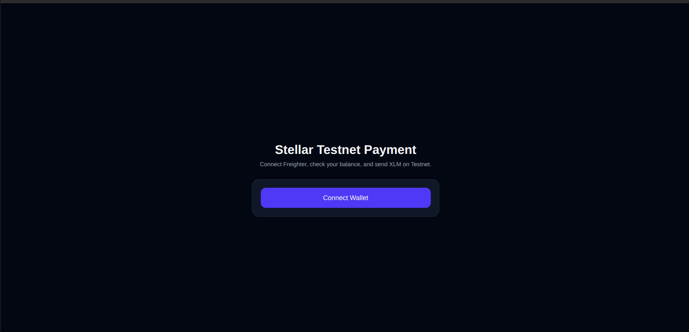
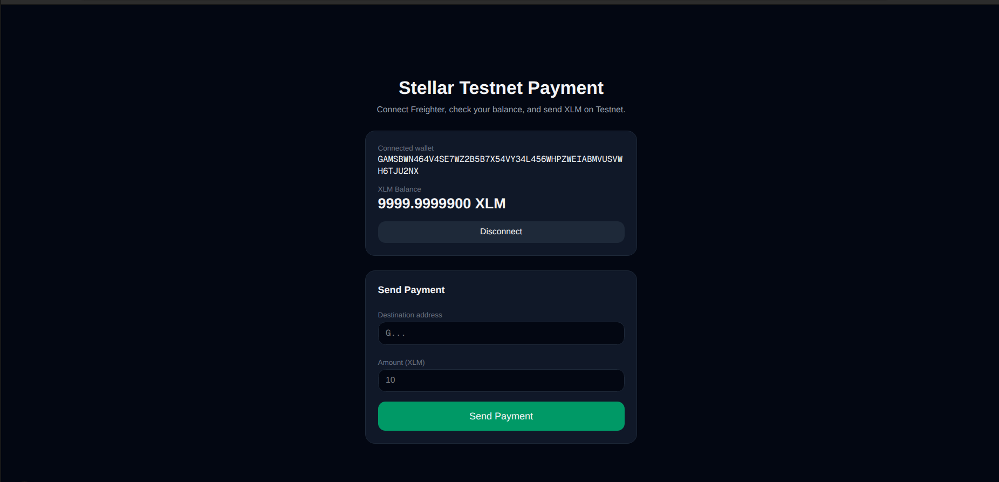
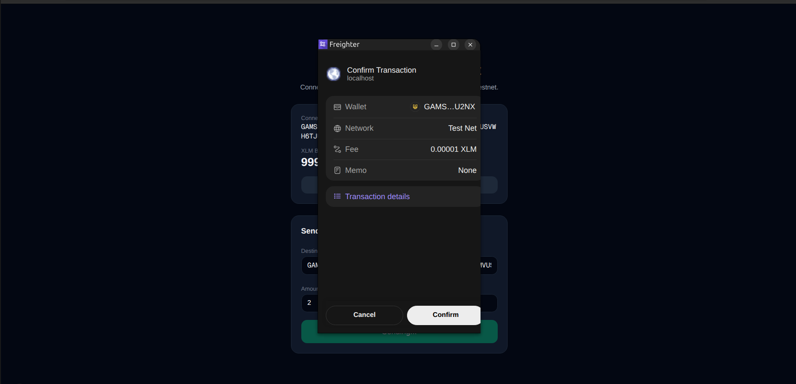
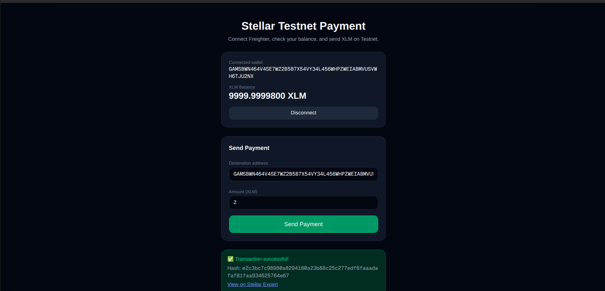

# Stellar Testnet Payment dApp

A beginner-friendly payment dApp built for the Stellar White Belt (Level 1) challenge. Users can connect their Freighter wallet, view their XLM balance on the Stellar Testnet, and send XLM to any address — with clear transaction feedback, including the transaction hash.

## Features

- Connect and disconnect the Freighter wallet
- Uses the Stellar Testnet
- Fetch and display the connected wallet's XLM balance
- Send XLM payments on the Stellar Testnet
- Transaction feedback: success/failure state and transaction hash
- Link to view the transaction on Stellar Expert
- Modern, dark-themed, responsive UI
- Basic error handling for wallet, network, and transaction issues

## Tech Stack

- **Frontend Framework:** Next.js (React Hooks)
- **Styling:** Tailwind CSS (modern, dark-themed, responsive design)
- **Blockchain:** Stellar Testnet
- **Wallet:** Freighter
- **Blockchain SDK:** Stellar JavaScript SDK (logic in `lib/stellar-helper.ts`)

## Prerequisites

- Node.js (v18 or newer)
- The [Freighter wallet](https://www.freighter.app/) browser extension
- Freighter set to the **Testnet** network
- A testnet account funded via [Friendbot](https://friendbot.stellar.org/)

## Setup Instructions (Run Locally)

Clone the repository:

git clone https://github.com/bybardia/stellar-next-payment-dapp.git
cd stellar-next-payment-dapp

Install dependencies:

npm install

Run the development server:

npm run dev

Then open http://localhost:3000 in your browser.

## How to Use

1. Install the Freighter wallet and switch it to **Testnet**.
2. Fund your testnet account using Friendbot.
3. Open the app and click **Connect Wallet**.
4. Approve the connection in Freighter.
5. View your connected address and XLM balance.
6. Enter a destination address and an amount.
7. Click **Send Payment** and approve the transaction in Freighter.
8. See the transaction result and hash in the UI.

## Screenshots

### Wallet Connected State

### Balance Displayed

### Sending Testnet Transaction

### Transaction Result Shown to the User

## License

MIT
